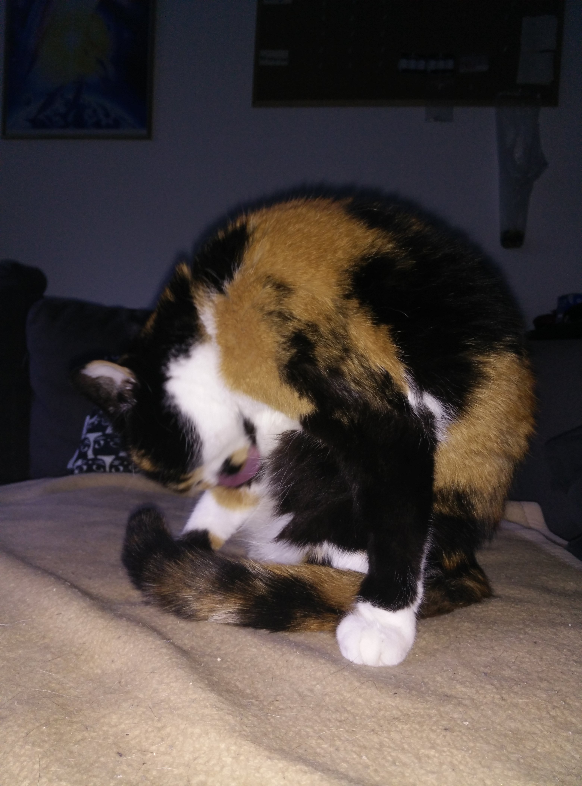

# bilder_warnung_grafischer_inhalt

Inhaltsverzeichnis
=================

* [1allgemeine_fotos_nach_der_behandlung_tierklinik_elisabeth_kellerwessel_18.07.2020](#1allgemeine_fotos_nach_der_behandlung_tierklinik_elisabeth_kellerwessel_18072020)
   * [IMG_20200719_080003.jpg](#img_20200719_080003jpg)
   * [IMG_20200719_185233.jpg](#img_20200719_185233jpg)
   * [IMG_20200719_192740.jpg](#img_20200719_192740jpg)
   * [IMG_20200719_211300.jpg](#img_20200719_211300jpg)
   * [IMG_20200720_010552.jpg](#img_20200720_010552jpg)
   * [IMG_20200720_185220.jpg](#img_20200720_185220jpg)
   * [IMG_20200720_210604.jpg](#img_20200720_210604jpg)
   * [IMG_20200721_122144.jpg](#img_20200721_122144jpg)
   * [IMG_20200721_141840.jpg](#img_20200721_141840jpg)
   * [IMG_20200721_141857.jpg](#img_20200721_141857jpg)
* [2nachbehandlung_kleintierpraxis_anja_lydia_busch_28.07.2020](#2nachbehandlung_kleintierpraxis_anja_lydia_busch_28072020)
   * [IMG_20200728_164500_86935FB5-FAA9-4B51-9279-1631FBC8B501_nach_wundtoilette.JPG](#img_20200728_164500_86935fb5-faa9-4b51-9279-1631fbc8b501_nach_wundtoilettejpg)
   * [IMG_20200728_164502_nach_wundtoilette.JPG](#img_20200728_164502_nach_wundtoilettejpg)
   * [IMG_20200729_062510_aktueller_status.jpg](#img_20200729_062510_aktueller_statusjpg)
   * [IMG_20200730_081245_aktueller_status.jpg](#img_20200730_081245_aktueller_statusjpg)
   * [IMG_20200731_070928_aktueller_status.jpg](#img_20200731_070928_aktueller_statusjpg)
   * [IMG_20200801_100559.jpg](#img_20200801_100559jpg)
   * [IMG_20200802_094753.jpg](#img_20200802_094753jpg)
   * [IMG_20200803_084234.jpg](#img_20200803_084234jpg)
   * [IMG_20200804_061809_obere_und_untere_naht_gezogen_und_bepanthen_aufgetragen.jpg](#img_20200804_061809_obere_und_untere_naht_gezogen_und_bepanthen_aufgetragenjpg)
   * [IMG_20200804_094119.jpg](#img_20200804_094119jpg)
   * [IMG_20200805_083107.jpg](#img_20200805_083107jpg)
   * [IMG_20200806_084112.jpg](#img_20200806_084112jpg)
   * [IMG_20200807_100350_alle_nähte_gezogen.jpg](#img_20200807_100350_alle_nähte_gezogenjpg)
   * [IMG_20200808_092305_halskrause_abgenommen.jpg](#img_20200808_092305_halskrause_abgenommenjpg)
   * [IMG_20200808_093343_halskrause_wieder_aufgesetzt.jpg](#img_20200808_093343_halskrause_wieder_aufgesetztjpg)
   * [IMG_20200808_151947.jpg](#img_20200808_151947jpg)
   * [IMG_20200809_103310.jpg](#img_20200809_103310jpg)
   * [IMG_20200810_103829.jpg](#img_20200810_103829jpg)
   * [IMG_20200810_204148_halskrause_wieder_abgenommen.jpg](#img_20200810_204148_halskrause_wieder_abgenommenjpg)
* [3allgemeine_fotos_nach_der_behandlung_kleintierpraxis_anja_lydia_busch_28.07.2020](#3allgemeine_fotos_nach_der_behandlung_kleintierpraxis_anja_lydia_busch_28072020)
   * [IMG_20200731_140033.jpg](#img_20200731_140033jpg)
   * [IMG_20200731_185743.jpg](#img_20200731_185743jpg)
   * [IMG_20200731_185817.jpg](#img_20200731_185817jpg)
   * [IMG_20200731_185842.jpg](#img_20200731_185842jpg)
   * [IMG_20200731_210733.jpg](#img_20200731_210733jpg)
   * [IMG_20200803_090753.jpg](#img_20200803_090753jpg)
   * [IMG_20200803_091627.jpg](#img_20200803_091627jpg)
   * [IMG_20200803_091713.jpg](#img_20200803_091713jpg)
   * [IMG_20200806_121354.jpg](#img_20200806_121354jpg)
   * [IMG_20200806_121527.jpg](#img_20200806_121527jpg)
   * [IMG_20200806_122129.jpg](#img_20200806_122129jpg)
   * [IMG_20200808_094922.jpg](#img_20200808_094922jpg)
   * [IMG_20200808_095433.jpg](#img_20200808_095433jpg)

## 1allgemeine_fotos_nach_der_behandlung_tierklinik_elisabeth_kellerwessel_18.07.2020
### IMG_20200719_080003.jpg

### IMG_20200719_185233.jpg

### IMG_20200719_192740.jpg

### IMG_20200719_211300.jpg

### IMG_20200720_010552.jpg

### IMG_20200720_185220.jpg

### IMG_20200720_210604.jpg

### IMG_20200721_122144.jpg

### IMG_20200721_141840.jpg

### IMG_20200721_141857.jpg

## 2nachbehandlung_kleintierpraxis_anja_lydia_busch_28.07.2020
### IMG_20200728_164500_86935FB5-FAA9-4B51-9279-1631FBC8B501_nach_wundtoilette.JPG

### IMG_20200728_164502_nach_wundtoilette.JPG

### IMG_20200729_062510_aktueller_status.jpg

### IMG_20200730_081245_aktueller_status.jpg

### IMG_20200731_070928_aktueller_status.jpg

### IMG_20200801_100559.jpg

### IMG_20200802_094753.jpg

### IMG_20200803_084234.jpg

### IMG_20200804_061809_obere_und_untere_naht_gezogen_und_bepanthen_aufgetragen.jpg

### IMG_20200804_094119.jpg

### IMG_20200805_083107.jpg

### IMG_20200806_084112.jpg

### IMG_20200807_100350_alle_nähte_gezogen.jpg

### IMG_20200808_092305_halskrause_abgenommen.jpg

### IMG_20200808_093343_halskrause_wieder_aufgesetzt.jpg

### IMG_20200808_151947.jpg

### IMG_20200809_103310.jpg

### IMG_20200810_103829.jpg

### IMG_20200810_204148_halskrause_wieder_abgenommen.jpg

## 3allgemeine_fotos_nach_der_behandlung_kleintierpraxis_anja_lydia_busch_28.07.2020
### IMG_20200731_140033.jpg

### IMG_20200731_185743.jpg

### IMG_20200731_185817.jpg

### IMG_20200731_185842.jpg

### IMG_20200731_210733.jpg

### IMG_20200803_090753.jpg

### IMG_20200803_091627.jpg

### IMG_20200803_091713.jpg

### IMG_20200806_121354.jpg

### IMG_20200806_121527.jpg

### IMG_20200806_122129.jpg

### IMG_20200808_094922.jpg

### IMG_20200808_095433.jpg

