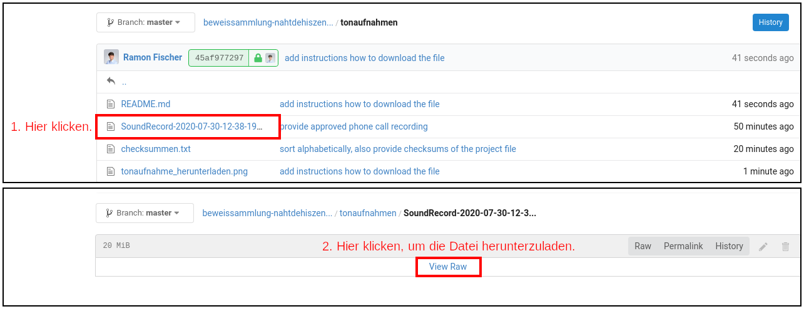

# Wie man die Datei herunterlädt
[](tonaufnahme_herunterladen.png)

# `SoundRecord-2020-07-30-12-38-19_telefonat_mit_frau_kellerwessel.mp3`
## Sätze, bei denen ich unterbrochen wurde
### 08:12
> [...], dass Frau Busch nur fünf Minuten von mir entfernt wohnt...

...und im Notfall wäre ich zu ihr gegangen."

### 08:17
> [...] einen Tag. Und das wollte ich eigentlich vermeiden, weil ich eigentlich schon dachte, dass...

...aus welchem Grund auch immer, Schmusi in der Klink "übernachten" soll.

### 11:44
> [...] was ich sehr merkwüdig finde; also, jetzt angenommen, diese "Jameda"-Bewertungen oder auch die Bewertungen bei "Google" würden jetzt alle stimmen. Und ich habe halt gesehen...

..., dass es Paralleln zu meinem aktuellen Fall gibt und nicht davon ausgehen kann, dass das nur ein Einzelfall ist. Das Ganze wird dann mit der Aussage von Frau Busch auch noch untermauert, die Sie kennt. Also muss da, meiner Meinung nach, eine gewisse Methodik dahinterstecken, die vermutlich schon länger praktiziert wird.

### 24:30
> [...] also war es dann richtig die Nähte schon nach zehn Tagen zu ziehen? Weil es war schon so ...

..., dass in der Praxis von Frau Busch, bei der Entfernung der Nähte, jede Menge Wundwasser und Eiter aus der Wunde geplatzt ist und die Haut war nur sehr leicht versiegelt.

### 25:48
> [...] ja, ich muss mir nochmal die Bilder von der Frau Busch angucken, weil...

...nach der Wundtoilette konnte ich ganz klar sehen, dass die Entzündung die Wunde signifikant vergrößerte. Es musste viel nekrotisches Material entfernt werden, um die Wunde überhaupt wieder schließen zu können.

## Themen, die ausgelassen wurden
* unnötige Allgemeinanästhesie und warum keine Regionalanästhesie?

## Zeiträume, die ich aus datenschutztechnischen Gründen zensieren musste
### 01:11 - 01:13
Frau an der Rezeption hatte der Aufnahme nicht zugestimmt.

### 10:00 - 10:13
Tastaturgeräusche im Hintergrund.

# `SoundRecord-2020-07-30-12-38-19_telefonat_mit_frau_kellerwessel.wav`
Die Datei habe ich aus Speicherplatzgründen zu einer `mp3-Datei` umgewandelt:

| Dateiname                                                             | Dateigröße in Byte          | Kommentar
| --------------------------------------------------------------------- | --------------------------- | ---------
| `SoundRecord-2020-07-30-12-38-19_telefonat_mit_frau_kellerwessel.wav` | 155.990.060                 | Originaldatei, unbearbeitet
| `SoundRecord-2020-07-30-12-38-19_telefonat_mit_frau_kellerwessel.mp3` | 21.108.538                  | bearbeitet und umgewandelt

## Checksummen
```no-highlight
SoundRecord-2020-07-30-12-38-19_telefonat_mit_frau_kellerwessel.wav

BLAKE2: 521d23179b2e40dd77d774ac153fcf2fbd7b7e50fa70351b78d32d32c1bcaaa6a051d8eac4505bf1f676cee02dce57658c9bd5ec51fd0f2af42d1322293ce551
SHA256: c42b0cff0bcc38c365264da2ada6337c29faf1e8618efed1f3ffdc7a1a97ac35
SHA512: 12cdf411b8f3825c2a015e080b09c626e6429039cb8c68d44697c3b8ca04066a557c4dd2b5e55a9f3ba4ed1b2be3de14cdf868a3e32a4fffb22880e1f700d010
```
```no-highlight
SoundRecord-2020-07-30-12-38-19_telefonat_mit_frau_kellerwessel.mp3

BLAKE2: 502591626af4aa903434267f64d025f3ce8595e255caf231af9892f9004e5a97629d308aede6f87a3a2fd456499a00cf8061673fe586cfe9be75722b957c938c
SHA256: 5372b5e84e4e7c1f4e414a472d175b47122bdc79e6918613679e6b3524b3da23
SHA512: 9402f5b5c1218963888555d650571a595588beb8b321efcd8db6da1629b7090e189772b3a7cd869c1a84229943cdff009f7a0383dea8ee6b5575e6be69c69952
```
